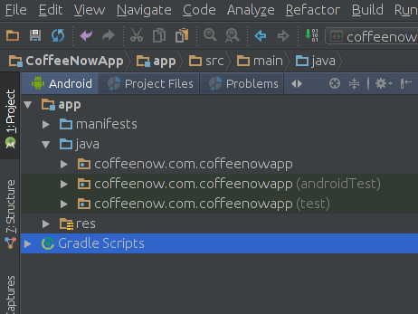

# Unit Tests
Unit testing is always a good idea but with the current configuration of
Travis CI it is even more important because it means an emulator is not needed
and can greatly imporove build times.

# Setup Unit Test in Android Studio
There are plenty of great documents available explaining how to setup unit
tests in Android Studio. In fact Android Studio by default will setup unit
testing for you when creating a new project.

In the above image the "androidTest" directory contains Android UI tests while
the "test" directory contains Unit Tests.

The build.gradle file found in the app module ```app/build.gradle``` will
typically contain a dependency for junit:
```groovy
testCompile 'junit:junit:4.12'
```
If you don't see that dependency in your build.gradle file then add it to
support unit testing.

# Writing a Unit Test
Unit testing is a topic on its own but here are a couple example tests from
the CoffeeNowApp tests. These check that display functions return the expected
format for different conditions.
```java
public class CoffeeMakerModelTest {

    @Test
    public void coffeeMakerDisplay() {
        CoffeeMaker cm = new CoffeeMaker("test");

        cm.setVolume(1);
        assertEquals("test (1 cups)", cm.toString());

        cm.setLatitude(0.1);
        cm.setLongitude(0.1);
        assertEquals("test (1 cups) -- Lat: 0.100 Long: 0.100", cm.toString());
    }
}
```
```java
public class UserModelTest {

    @Test
    public void userDisplayTest() {
        User user = new User("123", "Joe", "joe@email.com");

        assertEquals("Joe (joe@email.com)", user.toString());
    }
}
```